# Asymmetric-Learned-Image-Compression
Asymmetric learned compression with Hierarchical CNN &amp; DWAN attention. Superior compression: BPP≤0.4, SSIM≥0.9, 27MB lightweight model. Outperforms traditional codecs with 2stotal inference.
> **Ultra-Lightweight Neural Image Compression with Superior Performance**

A state-of-the-art asymmetric learned image compression model that achieves **exceptional compression ratios (BPP ≤ 0.4)** while maintaining **high visual quality (SSIM ≥ 0.9, PSNR > 34dB)** with a remarkably **lightweight architecture (27MB model size)** and **lightning-fast inference (<2s for encoding+decoding)**.

---

## 🎯 Key Achievements

Our model **outperforms traditional codecs** and competes with state-of-the-art learned compression methods:

| Method | Encoding Time | Decoding Time | BPP | Model Size |
|--------|--------------|--------------|-----|------------|
| **VVC** | 402.27s | 0.607s | 0.0 | 7.2MB | - |
| **Lee2019** [22] | 10.721s | 37.88s | 17.0% | 123.8MB |
| **Hu2021** [17] | 35.7187s | 77.3326s | 11.1% | 84.6MB |
| **Cheng2020** [9] | 20.89s | 22.14s | 4.8% | 50.8MB |
| **Chen2021** [6] | 402.26s | 2405.14s | 8.6% | 200.99MB |
| **GLLMM** [16] | 467.90s | 467.90s | -3.13% | 77.08MB (241.03MB) |

### 🏆 Performance Highlights
- ✅ **BPP ≤ 0.4** consistently across diverse datasets
- ✅ **SSIM ≥ 0.9** on 90%+ of test images
- ✅ **PSNR > 34dB** on 89% of test images
- ✅ **27MB model size** - Most lightweight in class
- ✅ **~46s total time** (encoding + decoding) - Fast inference
- ✅ **Outperforms JPEG, JPEG2000, BPG, and VVC** in rate-distortion metrics

---

## 🏗️ Architecture

Our model features an **asymmetric encoder-decoder design** with innovative components:
Input Image → Core Encoder (g_a) → DWAN Attention → Quantization → Hyper Encoder (h_a)
↓
Entropy Model
↓
Reconstruction ← Core Decoder (g_s) ← PQF + Context Model ← Hyper Decoder (h_s)

### 🔑 Novel Components

1. **Hierarchical CNN (HCNN)** - Replaces Multi-Scale Residual Blocks (MSRB)
   - Lightweight depthwise separable convolutions
   - MBConv blocks with expansion ratios
   - Progressive multi-scale feature extraction

2. **DWAN Attention** - Replaces traditional importance attention
   - Dual Wavelet Transform-based channel attention
   - Frequency-aware feature selection
   - Spectral band importance weighting

3. **Post-Quantization Filter (PQF)**
   - Mitigates quantization artifacts
   - Lightweight residual refinement
   - Enhanced spectral domain processing

4. **SSM Context Model**
   - Local + global context fusion
   - Efficient entropy coding
   - Adaptive rate control

5. **Asymmetric Design**
   - Complex encoder for better compression
   - Lightweight decoder for fast reconstruction
   - Optimized for deployment efficiency

---

## 📐 Architecture Diagram

```mermaid
graph TD
    A["Input Image (x)"] --> B["Core Encoder (gₐ)"]
    B --> C["DWAM Attention Map"]
    C --> D["Masked Latent (ỹ)"]
    D --> E["Hyper Encoder (hₐ)"]
    E --> F["Quantization (Q)"]
    F --> G["Arithmetic Encoder (AE)"]
    G --> H["Bits"]
    H --> I["Arithmetic Decoder (AD)"]
    I --> J["Hyper Decoder (hₛ)"]
    J --> K["Context Model (cₘ)"]
    D --> L["Quantized Latent (ỹ̂)"]
    K --> L
    L --> M["Core Decoder (gₛ)"]
    M --> N["Reconstruction (x̂)"]

    %% Apply black background and white text to all nodes
    style A fill:#000000,stroke:#333,stroke-width:1px,color:#ffffff
    style B fill:#000000,stroke:#333,stroke-width:1px,color:#ffffff
    style C fill:#000000,stroke:#333,stroke-width:1px,color:#ffffff
    style D fill:#000000,stroke:#333,stroke-width:1px,color:#ffffff
    style E fill:#000000,stroke:#333,stroke-width:1px,color:#ffffff
    style F fill:#000000,stroke:#333,stroke-width:1px,color:#ffffff
    style G fill:#000000,stroke:#333,stroke-width:1px,color:#ffffff
    style H fill:#000000,stroke:#333,stroke-width:1px,color:#ffffff
    style I fill:#000000,stroke:#333,stroke-width:1px,color:#ffffff
    style J fill:#000000,stroke:#333,stroke-width:1px,color:#ffffff
    style K fill:#000000,stroke:#333,stroke-width:1px,color:#ffffff
    style L fill:#000000,stroke:#333,stroke-width:1px,color:#ffffff
    style M fill:#000000,stroke:#333,stroke-width:1px,color:#ffffff
    style N fill:#000000,stroke:#333,stroke-width:1px,color:#ffffff
```



### Component Legend
- **LN**: LayerNorm + PReLU (Lightweight normalization replacing GDN/IGDN)
- **HCNN**: Hierarchical CNN with MBConv blocks
- **DWAN**: Dual Wavelet Attention Network
- **PQF**: Post-Quantization Filter with wavelet refinement
- **C_m**: Context Model (SSM-based local+global fusion)

---
```
## 📁 Project Structure

learned_image_compression/
├── requirements.txt
├── README.md
└── src/
├── data/
│ ├── train/
│ │ ├── flickr/ # Flickr30K training images
│ │ ├── liu4k/ # Liu4K high-res images
│ │ └── clic/ # CLIC training images
│ └── test/
│ ├── kodak/ # Kodak24 test set
│ └── clic/ # CLIC test set
├── losses/
│ └── compression_loss.py # Rate-distortion loss
├── models/
│ ├── hierarchical_cnn.py # HCNN implementation
│ ├── fixed_compression_model.py # Main model
│ └── wavelet_layers.py # DWT/IDWT layers
├── train.py # Training script
└── test.py # Evaluation script
### Installation
- Python 3.10.x is recommened
1. **Clone the repository**
git clone ___
```
2. **Install dependencies**

### Dependencies (requirements.txt)

# Core packages
```
numpy>=1.21.0,<2.0
pillow>=8.3.0
matplotlib>=3.5.0
tqdm>=4.62.0
PyWavelets==1.3.0
tensorboard>=2.8.0
opencv-python>=4.6.0
scikit-image>=0.19.0
pandas>=2.0.0,<3.0.0

---
```
## 📊 Dataset Preparation

### Training Datasets

Download and organize datasets in the following structure:
```
src/data/train/
├── flickr/ # Flickr30K dataset
├── liu4k/ # Liu4K high-resolution dataset
└── clic/ # CLIC 2020 training dataset
```
🖼️ **Note:** All images are rescaled to **384×384** before training.

**Dataset Sources:**
- [Flickr30K](http://shannon.cs.illinois.edu/DenotationGraph/)
- [Liu4K](https://github.com/liujiahao/CompressionData)
- [CLIC](http://compression.cc/)

### Test Datasets

```
src/data/test/
├── kodak/ # Kodak24 benchmark
└── clic/ # CLIC test set
```
**Test Sources:**
- [Kodak24](http://r0k.us/graphics/kodak/)
- [CLIC Test](http://compression.cc/)

---

## 🏋️ Training

### Quick Start Training

cd src
python train.py

### Training Configuration

Edit the `PaperConfig` class in `train.py` to customize training parameters:

class PaperConfig:
NUM_EPOCHS = 150
BATCH_SIZE = 8
ACCUMULATION_STEPS = 1
NUM_WORKERS = 8

### Training Features

- ✅ **Multi-objective optimization** (BPP + PSNR + SSIM)
- ✅ **Gradient accumulation** for effective large batch training
- ✅ **Mixed precision training** (FP16) for faster convergence
- ✅ **Automatic checkpointing** with best model selection
- ✅ **Learning rate scheduling** with exponential decay
- ✅ **PQF regulation** in early epochs
- ✅ **Comprehensive logging** with TensorBoard support

### Monitor Training

Training progress is logged to:
- Console output with progress bars
- `logs/training.log` - Detailed training log
- `logs/training_history_lambda*.json` - Metrics history
- `checkpoints/` - Model checkpoints

---

## 🧪 Evaluation

### Run Inference

cd src
python test.py

### Test Configuration

--checkpoint PATH # Path to model checkpoint
--test-dir PATH # Test dataset directory
--output-dir PATH # Output directory for results
--batch-size INT # Batch size for inference
--save-reconstructions # Save reconstructed images
--compute-metrics # Compute PSNR/SSIM/BPP

### Evaluation Metrics

The model is evaluated on:
- **PSNR** (Peak Signal-to-Noise Ratio) - Reconstruction quality
- **SSIM** (Structural Similarity Index) - Perceptual quality
- **BPP** (Bits Per Pixel) - Compression rate
- **Encoding/Decoding Time** - Inference speed

---

## 📈 Results

### Quantitative Results on Kodak24

| Metric | Value |
|--------|-------|
| **Average PSNR** | 34.2 dB |
| **Average SSIM** | 0.92 |
| **Average BPP** | 0.38 |
| **Model Size** | 27 MB |
| **Encoding Time + Decoding Time** | 3s (avg) |

### Rate-Distortion Performance

Our model achieves **superior rate-distortion trade-offs** compared to:
- ✅ JPEG (traditional)
- ✅ JPEG2000 (wavelet-based)
- ✅ BPG (HEVC-based)
- ✅ VVC (latest video codec)

### Quality Distribution
- **89% of images** achieve PSNR > 34dB
- **93% of images** achieve SSIM > 0.9
- **100% of images** achieve BPP < 0.4

---

## 🔬 Technical Details

### Key Innovations

1. **Hierarchical CNN (HCNN)**
   - Replaces standard MSRB blocks
   - MobileNet-inspired inverted bottleneck blocks
   - Depthwise separable convolutions
   - Parameter efficiency: ~60% reduction vs. MSRB

2. **DWAN Attention Mechanism**
   - Replaces importance attention maps
   - Haar wavelet decomposition (LL, LH, HL, HH)
   - Frequency-adaptive channel weighting
   - Importance range: [0.3, 1.0] for stability

3. **Asymmetric Architecture**
   - Encoder: 3 HCNN stages (complex)
   - Decoder: 1 HCNN stage (lightweight)
   - Compression ratio: 3:1 (encoder:decoder complexity)

4. **Lightweight Normalization**
   - LayerNorm + PReLU replaces GDN/IGDN
   - 40% fewer parameters
   - Faster training convergence

5. **Enhanced Context Model**
   - SSM-style local+global fusion
   - Adaptive entropy parameter prediction
   - Improved rate estimation

### Loss Function

Rate-distortion optimization with multi-objective scoring:
```
L = D + λ_RD · R + λ_PQF · L_PQF
```
where:

D: Distortion (MSE)

R: Rate (H_y + H_z entropy)

L_PQF: Post-quantization filter loss

λ_RD: Rate-distortion trade-off (0.05-0.1)

λ_PQF: PQF weight (5.0 early epochs, 0.0 later)

## ⭐ Star History

If you find this project useful, please consider giving it a star! ⭐
